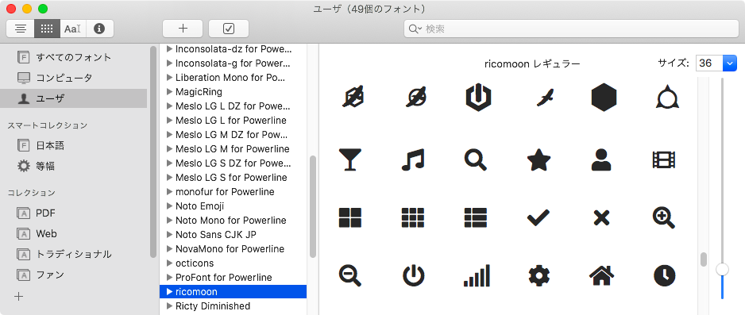

## ricomoon



https://icomoon.io/

https://github.com/edihbrandon/RictyDiminished

https://github.com/FortAwesome/Font-Awesome

https://octicons.github.com/

### use

```sh
$ mkdir -p ~/.local/share/fonts
$ git clone https://github.com/syui/ricomoon
$ cp !$:t/ricomoon.ttf ~/.local/share/fonts
```

terminal font setting.

```bash
# mac
$ open ~/.local/share/fonts/ricomoon.ttf
$ fc-cache -fv
```

### fontforge

```sh
$ git clone https://github.com/syui/ricomoon
$ cd !$:t
$ git clone https://github.com/edihbrandon/RictyDiminished
$ git clone https://github.com/FortAwesome/Font-Awesome
$ mv RictyDiminished/RictyDiminished-Regular.ttf ./font/ricty.ttf
$ mv Font-Awesome/webfonts/fa-brands-400.ttf ./font/awesome-a.ttf
$ mv Font-Awesome/webfonts/fa-regular-400.ttf ./font/awesome-b.ttf
$ fontforge -script bin/script.pe
$ open ricomoon.ttf
```

### powerline.zsh

https://github.com/syui/powerline.zsh
